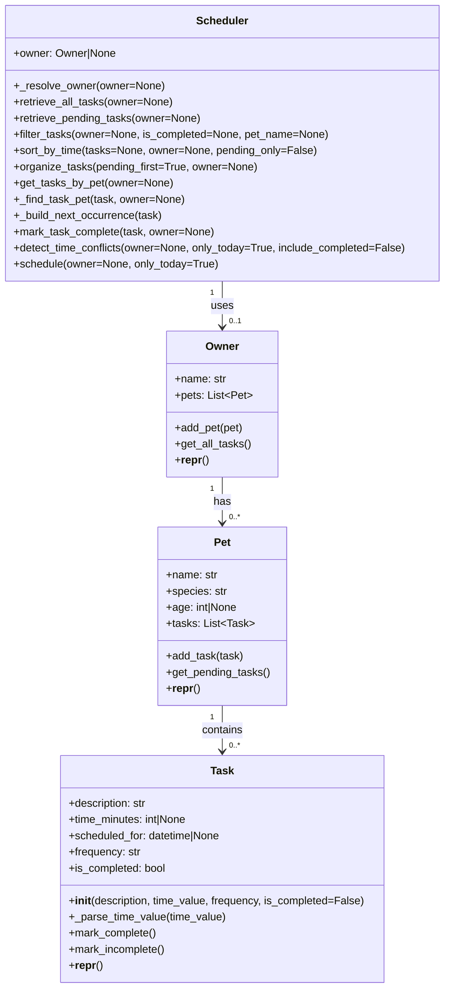

# PawPal+ Project Reflection

## 1. System Design
The initial actions would be to add a pet, schedule a walk, and see today's tasks.

**a. Initial design**

- Briefly describe your initial UML design.
There would be a Pet class:
Attributes: name, species, age, breed, special needs
Methods: add_special_needs

Owner class: 
Attributes: name, available minutes, preferred start time, list of pets
Methods: add_pet, get_total_time

Task class:
Attributes: title, duration, priority, category, is_required
Methods: priority_score 

ScheduledTask class: 
Attributes: task, start, end, reason
Methods: duration

## To be used later

##
- What classes did you include, and what responsibilities did you assign to each?
I included a Pet class, which is responsible for describing the pet and also add methods like add_special_need.
There is also the Owner class, responsible for describing the owner and it also contains a list of Pets which could be added as well as to get the available time.
There is the Task class which represents the tasks related to pet care and includes methods like getting the priority score.
Lastly, there is the Scheduler class which contains a task and contains the duration.

**b. Design changes**

- Did your design change during implementation?
There is not much design change by AI but it did write down the function logic.
- If yes, describe at least one change and why you made it.

---

## 2. Scheduling Logic and Tradeoffs

**a. Constraints and priorities**

- What constraints does your scheduler consider (for example: time, priority, preferences)?
- How did you decide which constraints mattered most?

The scheduler currently considers three main constraints: task completion status, scheduled datetime, and recurrence frequency.

- Completion status: completed tasks are excluded from the generated daily schedule.
- Time: scheduled tasks are ordered chronologically, and tasks without a specific datetime are placed after scheduled tasks.
- Frequency: daily and weekly tasks automatically create the next occurrence when marked complete.

I prioritized these constraints because they directly affect whether the owner can follow a plan in real time.

- First priority was correctness of "what still needs to be done" (pending tasks only).
- Second was practical execution order (time-based sorting).
- Third was consistency over multiple days (recurring tasks).

**b. Tradeoffs**

- Describe one tradeoff your scheduler makes.
- Why is that tradeoff reasonable for this scenario?

One tradeoff is that conflict detection is lightweight: it only flags tasks with the exact same scheduled datetime and returns warnings instead of trying to auto-reschedule.

This tradeoff is reasonable for this scenario because it keeps the system simple, readable, and safe for early development.

- The owner still gets clear warnings about conflicts.
- The app avoids hidden automatic changes that could surprise the user.
- It leaves room for a future "smart rescheduling" feature once core reliability is stable.

---

## 3. AI Collaboration

**a. How you used AI**

- How did you use AI tools during this project (for example: design brainstorming, debugging, refactoring)?
- What kinds of prompts or questions were most helpful?

**b. Judgment and verification**

- Describe one moment where you did not accept an AI suggestion as-is.
- How did you evaluate or verify what the AI suggested?

---

## 4. Testing and Verification

**a. What you tested**

- What behaviors did you test?
- Why were these tests important?

**b. Confidence**

- How confident are you that your scheduler works correctly?
- What edge cases would you test next if you had more time?

---

## 5. Reflection

**a. What went well**

- What part of this project are you most satisfied with?

**b. What you would improve**

- If you had another iteration, what would you improve or redesign?

**c. Key takeaway**

- What is one important thing you learned about designing systems or working with AI on this project?
